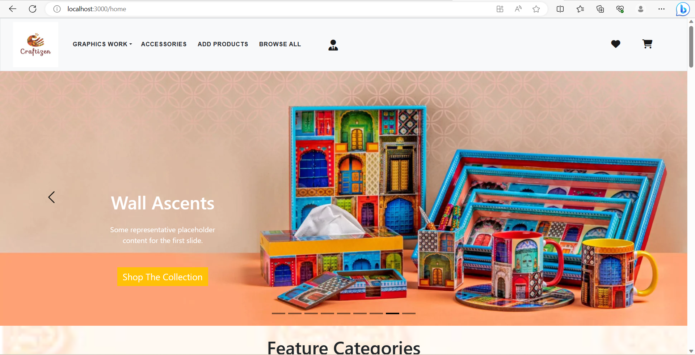

# MERN-CRAFTIGEN-WEBSITe
A Handicraft Web Application made using MERN Stack (MongoDB, Express js, React js, Node js)

The Handicraft Website is composed of the following Features:

### Front-End

* Sign-In & Sign-Up Pages.

* Uses Token based system, so only registered users can access the website  pssport js.

* Password hashing using passport js.

* Has a profile page, which will display all information about the signed in user.

* Also habe feature where User Can Add their product for selling nd also add price,img etc.

### Back-End

* Uses Express js based application for the backend process.

* Uses MongoDB atlas for storing the collections.

* Uses passport js for authenticating user and token based system.

* Uses passport js for hashing the password before sending the data to the cloud.
  
* Uses CRUD Operation where user can also update their profile.
  

**Screenshots:**
### Landing Page:




## Developed With

* [Visual Studio Code](https://code.visualstudio.com/) - A source code editor developed by Microsoft for Windows, Linux and macOS. It includes support for debugging, embedded Git control, syntax highlighting, intelligent code completion, snippets, and code refactoring
* [Node.js](https://nodejs.org/en/) - Javascript runtime
* [React](https://reactjs.org/) - A javascript library for building user interfaces
* [Webpack](https://webpack.js.org/) - A module bundler
* [SCSS](http://sass-lang.com/) - A css metalanguage
* [Bootstrap 5](https://getbootstrap.com/) - Bootstrap is an open source toolkit for developing with HTML, CSS, and JS
* [Axios](https://github.com/axios/axios) - Promise based HTTP client for the browser and node.js
* [Express js](http://expressjs.com/) - Express is a minimal and flexible Node.js web application framework that provides a robust set of features for web and mobile applications.
* [MongoDB atlas](https://www.mongodb.com/cloud/atlas) - MongoDB Atlas is the global cloud database service for modern applications.
* [Passport Js](http://www.passportjs.org/) - Passport is authentication middleware for Node.js. Extremely flexible and modular, Passport can be unobtrusively dropped in to any Express-based web application.
---


## Getting Started

These instructions will get you a copy of the project up and running on your local machine for development and testing purposes.

### Prerequisites

The following software is required to be installed on your system:

* Node 8.x
* Npm 3.x

Type the following commands in the terminal to verify your node and npm versions

```bash
node -v
npm -v
```

### Install

Follow the following steps to get development environment running.

* Clone _'CraftigenStore.git'_ repository from GitHub

  ```bash
  git clone https://github.com/Adarsh01208/CraftigenStore.git
  ```

   _OR USING SSH_

  ```bash
  git clone git@github.com:Adarsh01208/CraftigenStore.git
  ```

* Install node modules

   ```bash
   cd MiniProject
   cd frontend
   npm install
   cd..
   cd backend
   npm install
   ```


### Starting both front end and back end servers

* Build application

  This command will start the mongodb and the front end part.

  ```bash
  cd frontend
  npm start
  cd..
  cd backend
  npm run dev
  ```


---
